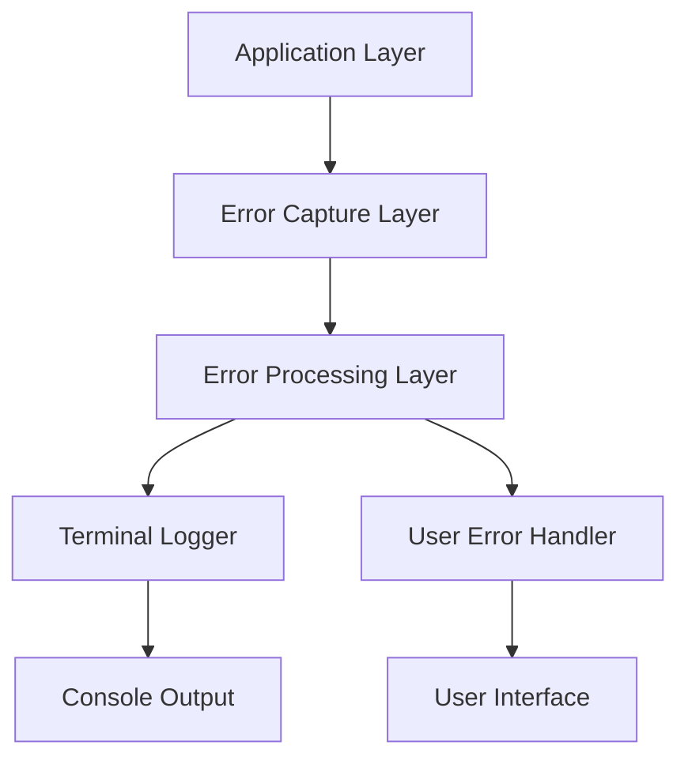

# Enhanced Error Reporting Design

## Overview

The Enhanced Error Reporting system provides comprehensive error handling, logging, and user feedback for the AI Interview Simulator chatbot application. The system captures errors at multiple levels, categorizes them appropriately, logs detailed diagnostic information to the terminal for developers, and presents user-friendly messages to end users. The design emphasizes clear error communication, actionable feedback, and robust error recovery mechanisms.

## Architecture

The error reporting system follows a layered architecture with three main components:

1. **Error Capture Layer**: Intercepts and captures errors from all application layers
2. **Error Processing Layer**: Categorizes, enriches, and formats error information
3. **Error Output Layer**: Handles terminal logging and user message presentation



## Components and Interfaces

### ErrorReporter Class
Central error management component that coordinates error handling across the system.

```javascript
interface ErrorReporter {
  captureError(error: Error, context: ErrorContext): void
  logToTerminal(errorInfo: ProcessedError): void
  sendToUser(errorInfo: ProcessedError): UserErrorResponse
  categorizeError(error: Error): ErrorCategory
}
```

### TerminalLogger Class
Handles detailed console logging for developers with structured output and visual indicators.

```javascript
interface TerminalLogger {
  logError(errorInfo: ProcessedError): void
  logSuccess(message: string, context?: object): void
  logWarning(message: string, context?: object): void
  logDebug(message: string, context?: object): void
}
```

### UserErrorHandler Class
Manages user-facing error messages and recovery options.

```javascript
interface UserErrorHandler {
  formatUserMessage(errorInfo: ProcessedError): UserErrorMessage
  suggestRecoveryActions(errorCategory: ErrorCategory): RecoveryAction[]
  handleRetryLogic(error: ProcessedError): RetryStrategy
}
```

### ErrorContext Interface
Provides contextual information about when and where errors occur.

```javascript
interface ErrorContext {
  requestId: string
  userId?: string
  endpoint: string
  timestamp: Date
  userAgent?: string
  requestPayload?: object
  systemState?: object
}
```

## Data Models

### ProcessedError
```javascript
interface ProcessedError {
  id: string
  category: ErrorCategory
  severity: 'LOW' | 'MEDIUM' | 'HIGH' | 'CRITICAL'
  originalError: Error
  context: ErrorContext
  userMessage: string
  developerMessage: string
  retryable: boolean
  suggestedActions: string[]
  timestamp: Date
}
```

### ErrorCategory
```javascript
enum ErrorCategory {
  API_RATE_LIMIT = 'API_RATE_LIMIT',
  API_AUTHENTICATION = 'API_AUTHENTICATION', 
  API_SERVICE_UNAVAILABLE = 'API_SERVICE_UNAVAILABLE',
  NETWORK_ERROR = 'NETWORK_ERROR',
  VALIDATION_ERROR = 'VALIDATION_ERROR',
  DATABASE_ERROR = 'DATABASE_ERROR',
  PARSING_ERROR = 'PARSING_ERROR',
  INTERNAL_ERROR = 'INTERNAL_ERROR',
  UNKNOWN_ERROR = 'UNKNOWN_ERROR'
}
```

### UserErrorMessage
```javascript
interface UserErrorMessage {
  title: string
  message: string
  type: 'error' | 'warning' | 'info'
  retryable: boolean
  actions?: {
    label: string
    action: () => void
  }[]
}
```

## Correctness Properties

*A property is a characteristic or behavior that should hold true across all valid executions of a system-essentially, a formal statement about what the system should do. Properties serve as the bridge between human-readable specifications and machine-verifiable correctness guarantees.*

<function_calls>
<invoke name="prework">
<parameter name="featureName">enhanced-error-reporting

Property 1: Universal error logging
*For any* error that occurs in the application, the Error_Reporter should log comprehensive diagnostic information to the terminal including error details, context, and timestamp
**Validates: Requirements 1.1**

Property 2: Rate limit error details
*For any* API rate limit error, the Terminal_Logger should display the specific limit type, remaining quota, and reset time in the logged output
**Validates: Requirements 1.2**

Property 3: Network error context logging
*For any* network error, the Terminal_Logger should log the request details, response status, and retry information
**Validates: Requirements 1.3**

Property 4: Authentication error token details
*For any* authentication error, the Terminal_Logger should log the token status and expiration details
**Validates: Requirements 1.4**

Property 5: Validation error field details
*For any* validation error, the Terminal_Logger should display the specific field that failed and the validation rule that was violated
**Validates: Requirements 1.5**

Property 6: Token limit user messaging
*For any* API token limit error, the User_Error_Handler should display a message indicating token exhaustion and suggested wait time
**Validates: Requirements 2.1**

Property 7: Network failure user messaging
*For any* network connection failure, the User_Error_Handler should show a user-friendly message about connectivity issues without exposing technical details
**Validates: Requirements 2.2**

Property 8: Invalid input explanation
*For any* invalid input error, the User_Error_Handler should explain what input is expected in clear, actionable terms
**Validates: Requirements 2.3**

Property 9: Service unavailable user guidance
*For any* service unavailable error, the User_Error_Handler should inform the user and suggest appropriate retry timing
**Validates: Requirements 2.4**

Property 10: Unknown error user safety
*For any* unknown error, the User_Error_Handler should provide a generic helpful message without exposing technical details or stack traces
**Validates: Requirements 2.5**

Property 11: Error categorization consistency
*For any* error that occurs, the Error_Reporter should categorize it with a specific, appropriate ErrorCategory from the defined enum
**Validates: Requirements 3.1**

Property 12: Error logging metadata completeness
*For any* error being logged, the Terminal_Logger should include timestamps, request IDs, and user context in the output
**Validates: Requirements 3.2**

Property 13: Error pattern detection
*For any* sequence of multiple similar errors, the Error_Reporter should detect patterns and log summary information rather than duplicate entries
**Validates: Requirements 3.3**

Property 14: Critical error highlighting
*For any* critical error, the Terminal_Logger should highlight it with visual indicators (colors, symbols, or formatting) to distinguish it from other log levels
**Validates: Requirements 3.4**

Property 15: Recovery logging
*For any* error that gets resolved, the Error_Reporter should log successful recovery attempts with details about the recovery method
**Validates: Requirements 3.5**

Property 16: Request context preservation
*For any* error that occurs, the Terminal_Logger should include the full request payload and headers in the diagnostic output
**Validates: Requirements 4.1**

Property 17: API failure response logging
*For any* API call failure, the Error_Reporter should log the exact API response and error codes received
**Validates: Requirements 4.2**

Property 18: Parsing error input display
*For any* parsing error, the Terminal_Logger should show the problematic input data that caused the parsing failure
**Validates: Requirements 4.3**

Property 19: Database error query logging
*For any* database operation failure, the Error_Reporter should log the query and connection status details
**Validates: Requirements 4.4**

Property 20: User interaction error sequence logging
*For any* error during user interactions, the Terminal_Logger should include the user action sequence that led to the error
**Validates: Requirements 4.5**

Property 21: Automatic retry with backoff
*For any* recoverable error, the Error_Reporter should attempt automatic retry with exponential backoff timing
**Validates: Requirements 5.1**

Property 22: Temporary error retry options
*For any* temporary error, the User_Error_Handler should provide options to retry the operation
**Validates: Requirements 5.2**

Property 23: Partial failure handling
*For any* partial failure scenario, the Error_Reporter should save successful operations and report only the failures
**Validates: Requirements 5.3**

Property 24: Recovery notification
*For any* system recovery from errors, the User_Error_Handler should notify the user of successful recovery
**Validates: Requirements 5.4**

Property 25: Persistent error escalation
*For any* errors that persist beyond retry attempts, the Error_Reporter should escalate to fallback mechanisms or offline mode
**Validates: Requirements 5.5**

## Error Handling

The system implements a multi-layered error handling strategy:

### Error Capture
- Global error handlers for unhandled exceptions
- Try-catch blocks around critical operations
- Promise rejection handlers for async operations
- Express.js error middleware for HTTP requests

### Error Classification
Errors are automatically classified based on:
- HTTP status codes (429 → RATE_LIMIT, 401 → AUTHENTICATION)
- Error message patterns (timeout → NETWORK_ERROR)
- Error source (database, API, validation)
- Custom error types thrown by application code

### Recovery Strategies
- **Immediate Retry**: For transient network issues
- **Exponential Backoff**: For rate limits and service unavailability
- **Fallback Responses**: Mock data when AI services are down
- **Graceful Degradation**: Reduced functionality when components fail

## Testing Strategy

### Unit Testing
The system will use Jest for unit testing with the following focus areas:
- Error categorization logic with various error types
- User message formatting for different error categories
- Terminal logging output format validation
- Recovery strategy selection based on error types

### Property-Based Testing
The system will use fast-check for property-based testing to verify:
- Universal error handling properties across all error types
- Consistent error categorization for similar error patterns
- User message safety (no technical details exposed)
- Terminal logging completeness for all error scenarios

Property-based tests will run a minimum of 100 iterations to ensure comprehensive coverage of error scenarios. Each property test will be tagged with comments referencing the specific correctness property from this design document using the format: **Feature: enhanced-error-reporting, Property {number}: {property_text}**

### Integration Testing
- End-to-end error flow testing from error occurrence to user notification
- API error simulation with various HTTP status codes
- Database connection failure scenarios
- Network timeout and connectivity issue simulation